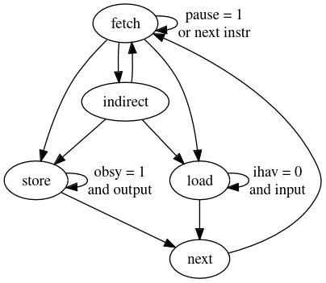

# LFSR CPU running Forth

* Author: Richard James Howe
* License: 0BSD / Public Domain
* Email: <mailto:howe.r.j.89@gmail.com>
* Repo: <https://github.com/howerj/lfsr-vhdl>

This project contains a CPU written in [VHDL][] for an [FPGA][] using a Linear Feedback Shift 
Register ([LFSR][]) instead of a Program Counter, this was sometimes done to save space as 
a [LFSR][] requires fewer gates than an adder, however on an FPGA it will make very
little difference as the units that make an FPGA (Slices/Configurable Logic
Blocks) have carry chains in them. The saving would perhaps be more apparent if
making the system out of [7400][] series ICs, or if laying transistors out by hand. 

See <https://github.com/howerj/lfsr> for more information. 

The system contains a fully working [Forth][] interpreter.

The project currently works in simulation (it outputs the startup message
"eForth 3.3" with a new line) and accepts input (try typing "words" when the
simulation in [GHDL][] is running). It has been synthesized for an FPGA (and it
should work), however I lack a suitable FPGA board to test the system on.

Here is an example session of the simulator running:

And the VHDL running under GHDL for a limited number of cycles:

# CPU Resource Utilization

The system runs at 137.489MHz (on a Spartan-6) according to the timing
report. The CPU itself is very small, here is a cut-down report on the
resources consumed for commit `e9e54f373cf508fc5d0718983c8f16921fa2311c`:

	+------------------------------------------------------------+
	| Module     | Slices | Slice Reg | LUTs  | BRAM/FIFO | BUFG |
	+------------------------------------------------------------+
	| top/       | 3/54   | 9/101     | 1/144 | 0/4       | 1/1  |
	| +system    | 0/29   | 0/43      | 0/81  | 0/4       | 0/0  |
	| ++bram     | 0/0    | 0/0       | 0/0   | 4/4       | 0/0  |
	| ++cpu      | 29/29  | 43/43     | 81/81 | 0/0       | 0/0  |
	| +uart_rx_0 | 11/11  | 24/24     | 38/38 | 0/0       | 0/0  |
	| +uart_tx_0 | 11/11  | 25/25     | 24/24 | 0/0       | 0/0  |
	+-------------------------------------------------------------+
	No LUTRAM/BUFIO/DSP48A1/BUFR/DCM/PLL_ADV used

The above is indicative only as the actual resources used may vary from
commit to commit, but also because of the tool chain and FPGA targeted.

Even given that though it is clear that this system is *small*. The CPU
only occupies 29 slices, which is only a little larger than the bit-serial
CPU available at <https://github.com/howerj/bit-serial>, and this 16-bit CPU
is *much* faster.

# Building

To build you will need `make`. To make the C Virtual Machine you will need a C
compiler of your choosing.

To run the C VM type:

	make run

You should be greeted by the message `eforth 3.3`. Type `bye` and hit `ENTER`
to quit (`CTRL-D` will not work, this is not a bug). Type `words` for a list of
defined Forth words. An example session:

	: ahoy cr ." GOODBYE, CRUEL WORLD!" cr ;
	ahoy
	2 2 + . cr
	bye

This is not a Forth tutorial. For a Forth tutorial look elsewhere. Try "the
internet". I am sure they have something.

Making the simulation requires `GHDL`:

	make simulation

There is a configuration file for the simulation in the file `tb.cfg` that
allows changing many test bench parameters without recompiling the test bench.
GHDL also allows you to set generics via the command line, which is done in the
`makefile`. For example `make simulation DEBUG=2` sets the top level debug
generic to `2`, bear in mind when changing the generics in `tb.vhd` that the
`makefile` can override these constants!

To build for an FPGA you will need `Xilinx ISE 14.7`:

	make synthesis implementation bitfile

# Instruction Set and System Design

A short summary of the instruction set and design:

* The machine is accumulator based.
* All instructions are 16-bits in length.
* The top four bits determine the instruction to be executed.
* The lowest twelve bits are the operand parameter.
* Addresses are in number of 16-bit cells, not bytes.
* The program counter is 8-bits in size and is advanced with a LFSR.
* The top most bit, part of the 4-bit instruction selector, determines 
whether the operand is used directly or whether or it loaded first.
* It is possible to configure at time of synthesis many parameters
of the core (polynomial value and LFSR width, jump conditions, using an 
add instruction, and more), not all of which are compatible with
the Forth image in the hex file `lfsr.hex`.

The instruction set has been carefully chosen so that it
should be very simple to implement in a bit-serial fashion
(much like my other CPU project at
<https://github.com/howerj/bit-serial> that runs on an FPGA), or
in the traditional bit parallel way. 

It has also been designed so that it should be possible to implement 
in 7400 series logic ICs (excluding ROM and RAM) as well as on an 
FPGA. There may be no savings in logic on an FPGA due to the fact that slices
have a built in carry chain (usually), but a comparison could be made
when the system is implemented on an FPGA (This has been done, there
is very little difference, but it is slightly smaller and faster than
using an adder even on an FPGA).

As the Program Counter does not use addition, it was decided that
addition should be removed from the instruction set. It would be a
bit weird to worry about all the gates the Program Counter is using and
then just include an adder elsewhere. The ADD instruction is sorely
missed and makes the Forth code more complex and slows it down. The
only other instruction that feels like it should be present
is bit-wise OR, in practice it is not used that much within the
interpreter so it not missed, it is reimplemented using bitwise AND
and INVERT (XOR against all bits set).

The instruction layout is:

	+----------+---------------+-------------------+
	|  BIT 15  | BITS 12 to 14 |    BITS 0 to 11   |
	+----------+---------------+-------------------+
	| INDIRECT | INSTRUCTION   | VALUE   / ADDRESS |
	+----------+---------------+-------------------+

The `INDIRECT` flag determines whether bits 0 to 11 are treated as
a value (not set) or an address (`INDIRECT` is set).

The `INSTRUCTION` field is 3-bits in size, the instructions are:

	0 : XOR   : ACC = ACC ^ ARG
	1 : AND   : ACC = ACC & ARG
	2 : LLS1  : ACC = ARG << 1
	3 : LRS1  : ACC = ARG >> 1
	4 : LOAD  : ACC = MEM[ARG]
	5 : STORE : MEM[ARG] = ACC
	6 : JUMP  : PC = ARG
	7 : JUMPZ : IF (ACC == 0) { PC = ARG }

All instructions advance the program counter except `JUMP`, and
(conditionally) `JUMPZ`. All instruction affect or use the accumulator
except the `JUMP` instruction (`JUMPZ` reads the accumulator value). 
`MEM` consists of a linear array of 16-bit values.

`XOR` is the first instruction, allowing instructions containing
all zeros to act as a NOP instruction if needed.

There is one special address, address 0. This address is never
incremented after an instruction is run as this is a lock up state for
the LFSR, the current instruction will be executed indefinitely. A way
to exit this condition is for the first instruction to be a jump to
address `1`, however any non-zero address will do. The system starts
up executing from address zero. Conditional jumps could be used to
determine whether to reset or halt the system if needed. Alternatively
a LFSR that used XNOR could have been used (the lockup state for which 
is all ones) but it was not as the jump mechanism is satisfactory.

`ACC` is the 16-bit accumulator.

`ARG` is either the zero extended 12-bit operand (the lowest 12-bits
of the instruction) as is, or the 16-bit value `MEM[operand]` if the
topmost bit of the instruction is set.

Input and Output is memory mapped, reading from a negative address
(high bit set) causes a byte to be read or output. This is triggered
from reading or writing to any negative address, if multiple
peripherals are to be added the address will have to be decoded
differently.

For the purposes of simulation `JUMP` will cause the CPU to halt if
the jump address is the same as the program counter. This is not
implemented in hardware.

The program counter uses a 8-bit LFSR to advance, that means only 256
16-bit values can be directly addressed by this CPU, this is not a
limitation that matters for the purpose of the software running on this
system, a complete Forth Programming Language image, as the Virtual
Machine that supports Forth can be written in under 256 instructions
for this system. That Forth Virtual Machine can address more memory
by using LOAD/STORE to access values outside the 256 instruction range.

The instruction set is liable to change in the future if it is possible
to make the system even smaller by doing so and still support a fully
functional Forth interpreter.

# State machine diagrams

The following can be used to create a state-machine diagram with
Graphviz, this can be done online, see <https://dreampuf.github.io/GraphvizOnline/>:

	digraph LfsrCpu {
		fetch -> fetch [label = "pause = 1\nor next instr"];
		fetch -> indirect;
		fetch -> load;
		fetch -> store;
		indirect -> fetch;
		indirect -> load;
		indirect -> store;
		load -> load [label = "ihav = 0\nand input"];
		load -> next;
		store -> next;
		store -> store [label = "obsy = 1\nand output"];
		next -> fetch;
	}

Alternatively, here is a veritable feast of a PNG file for both your lovely eye balls
to take in and gaze upon with wonder, or to just look at, whatever:

# Tracing

Edit `tb.cfg` and ensure that the number of clocks to run for is over `90000000` (or equal
to), and that we are running in interactive mode, the following configuration
file should work:

	Clocks.. # Number of clock cycles to run for
	90000000
	Forever. # If greater than zero run forever
	0
	Interact # Is this session interactive?
	2
	InWaitMs # Time to wait before getting user input
	10
	UartRep. # UART reporting level, if non zero `report` UART chars
	1
	LogFor.. # Extra debug logging for this many cycles
	100
	1Line... # Exit after getting one line of input if non zero
	1
	UChDelay # Delay (ms) between sending UART characters
	1
	CRLF.EOF # Line ending CRLF (1) or LF (0)?
	0

Then run the command:

	echo "bye" | make simulation DEBUG=2 > vhdl.txt

And then:

	echo "bye" | DEBUG=1 ./lfsr lfsr.hex 2> c.txt

And compare with:

	vimdiff vhdl.txt c.txt

You will notice differences, however they should be minor, obvious, and mostly
related to VHDL report messages. The instructions executed should be identical
so long as the input is identical, to make sure this is the case the line
endings also need to be made to be identical for both input streams.

Empirically the system averages 2.4 clock cycles (or 2.4 state changes) to execute a 
single instruction, this was measured by executing the default Forth image and feeding
it a line of text with the quit/halt word "bye" in it. This was calculated from the
following table, which contains the number of times the instruction has been encountered,
whether the instruction is the indirect variant (marked with an 'i'), the instruction, 
the number of cycles needed to execute that instruction and the cycles multiplied by
instruction cycle length.

	+--------+--------+----------+---------+---------+
	| cycles | indir? | instr?   | cyc/ins |         |
	+--------+--------+----------+---------+---------+
	| 369492 |        |  a_jmp   | 1       | 369492  |
	| 241070 |        |  a_jmpz  | 1       | 241070  |
	| 880098 |        |  a_load  | 3       | 2640294 |
	| 1450   |        |  a_lsr1  | 1       | 1450    |
	| 880388 |        |  a_store | 3       | 2641164 |
	| 206102 | i      |  a_and   | 2       | 412204  |
	| 65755  | i      |  a_jmp   | 2       | 131510  |
	| 32042  | i      |  a_jmpz  | 2       | 64084   |
	| 53057  | i      |  a_load  | 4       | 212228  |
	| 173287 | i      |  a_lsl1  | 2       | 346574  |
	| 17053  | i      |  a_store | 4       | 68212   |
	| 173513 | i      |  a_xor   | 2       | 347026  |
	+--------+--------+----------+---------+---------+
	Total Instructions executed: 3093307 
	Total Instruction cycles: 7475308

# To Do / Future Directions

* Improve the documentation; timing diagrams, more terminal capture,
  documentation from the sister project, and more information on the Forth
  interpreter itself could all be added.
* The Forth available at <https://github.com/howerj/subleq> is more advanced
  and could be reintegrated into this project.
* Optimize the CPU core:
  - The Input/Output system could be reworked, making I/O truly memory mapped.
* See <https://github.com/howerj/lfsr> for more information and suggestions.
* The number of these devices that could fit on one device could be quite
  large, limited by the number of Block RAMs available. Modifications
  would have to be made to program and interact with a matrix of these CPUs,
  but it might be a neat thing to do. They could take their input from the same
  UART and the same starting commands or boot image, synchronization could be 
  partially achieved with `pause`, `ihav` and `obsy` signals. Each CPU would
  need an identifier assigned to it. It might be a good idea to have a way for
  each CPU to talk to its immediate neighbors. Most of these problems could be
  solved with a adjustments to the I/O system and the addition of peripherals
  and pseudo peripherals.
* The `lfsr.vhd` file is quite configurable with many generics, the tool-chain
  could be made to generate Forth images that deal with the variants.
* A Dual-Port version of the CPU would be faster, although it would require more 
  resources. This CPU in its current form can share one half a Dual Port Block RAM 
  allowing very fast memory mapped I/O.
* The eForth image could be turned into ROM sections (the Forth Virtual Machine
  and the initial Forth dictionary could go here) and sections that can be stored
  in RAM. This ROM/RAM version would also execute faster, provided only the Forth
  VM was to be stored in ROM.
* Alternatively a Harvard version of the CPU could be made, the Forth VM stored
  in ROM, perhaps even encoded within the VHDL file for the LFSR CPU itself.
* A bit-serial version of this CPU could be made, it might be smaller, it would
  certainly be slower.
* A simulation written in VHDL using components based off of real 7400 series
  devices could be made. This should make it easier to build a physical version
  of this system out of 7400 series ICs, and will most likely be faster than
  other digital simulators. This would involve making components for each 7400
  series IC we would want to use, sticking to the common ones (NAND gates,
  counters, multiplexors, flip flops, comparators, decoders) would be best,
  as some of the more exotic devices (such as ALUs, adders, ...) can be harder
  to find.
* The article <https://www.fpgarelated.com/showarticle/797.php>, or
  Inside the Spartan-6: Using LUTs to optimize circuits by Victor Yurkovsky,
  publish June 24, 2015, contains information about optimizing LUT usage
  by explicitly instantiating and placing LUTs and other FPGA logic. If we
  really want to shrink this system, we could do the same here. There is also
  an interesting article about outputting VGA signals in only 7 slices:
  <https://www.fpgarelated.com/showarticle/42.php>.
* The instruction set could be played around with, there are some really
  interesting instructions such as `execute this register as an instruction`
  (which is appropriate for a register machine and not an accumulator machine,
  adding a full rotate and removing the shift left/right by one instructions, or 
  perhaps my favorite, using a Lookup Table (LUT) to determine what the output 
  should be for two inputs which would allow all two input logic gates to be 
  implemented, see <https://arnaud-carre.github.io/2024-10-06-vpternlogd/> for 
  an example of a three input version. Setting the LUT would require setting a
  4-bit register for a 2-input LUT, which could be tacked on to the JUMP
  instruction as we have bits to spare (we only use 8-bits).
* LFSR, and the related Cyclic Redundancy Checks (CRC), have many uses, Pseudo Random
  Number Generation (PRNG), test vector generation and checking, Built In Self 
  Tests (BIST), and more. Using LFSR for test vector generation, in both a test
  bench and in hardware, would allow us to query the CPU with many test
  patterns and efficiently compare this to a result, in hardware this could be
  part of a BIST peripheral that sets a pin high on success.
* This project would be a good candidate for the [Tiny Tapeout][] project,
  amongst my others projects. Tiny Tapeout allows designers to cheaply make
  their own physical silicon. The interface would be a problem and would
  require shifting data in and out N-bits at a time as there are a limited
  number of pins available to interface with external memory (both RAM and
  ROM ICs would be required). This would mean we would need to be able to
  pause the CPU in any state, or other modifications would need to be made.
  Perhaps <https://github.com/howerj/bit-serial> would make a better candidate?

# References

* <https://github.com/howerj/lfsr>
* <https://github.com/howerj/subleq>
* <https://github.com/howerj/bit-serial>
* <https://github.com/howerj/7400>
* <https://github.com/howerj/subleq-vhdl>
* <https://www.amazon.com/SUBLEQ-EFORTH-Forth-Metacompilation-Machine-ebook/dp/B0B5VZWXPL>
* <http://ghdl.free.fr/>
* <https://www.righto.com/2020/11/reverse-engineering-ram-storage-in.html>
* <https://sheep-thrills.net/NES_lockout_chip_address_smartness.html>
* <https://en.wikipedia.org/wiki/Texas_Instruments_TMS1000>
* <https://hackmii.com/2010/01/the-weird-and-wonderful-cic/>
* <https://www.eetimes.com/tutorial-linear-feedback-shift-registers-lfsrs-part-3/>
* <https://stackoverflow.com/questions/28179701/>
* <https://en.wikipedia.org/wiki/Computation_of_cyclic_redundancy_checks>
* <https://stackoverflow.com/questions/5781458/>
* <https://crypto.stackexchange.com/questions/67670/>
* <https://en.wikipedia.org/wiki/Cyclic_redundancy_check>

[GHDL]: http://ghdl.free.fr/
[FPGA]: https://en.wikipedia.org/wiki/Field-programmable_gate_array
[Forth]: https://en.wikipedia.org/wiki/Forth_(programming_language)
[make]: https://www.gnu.org/software/make/
[VHDL]: https://en.wikipedia.org/wiki/VHDL
[LFSR]: https://en.wikipedia.org/wiki/Linear-feedback_shift_register
[7400]: https://en.wikipedia.org/wiki/7400-series_integrated_circuits
[Tiny Tapeout]: <https://tinytapeout.com/>

